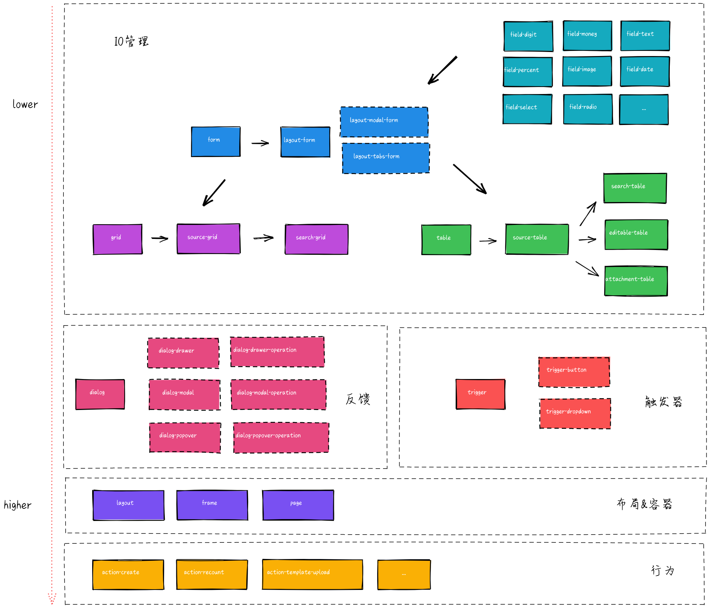

## 为什么不是 antd？

为什么不是 antd 的答案就是 pro-coms 的诞生原因，其实不管是 one-start 还是 pro-coms 都是在 ant-design 的设计体系下所进行的扩展，这都归功于 antd 良好的组件关系架构，合理的组件粒度大小及其规范的接口设计所带来的超强灵活性和扩展性，但是事实上在固定的场景或用途下组件的封装成为必然，原因是因为其所带来的开发效率，稳定性，一致性的提升显著，基于这个观点，那么我们就需要一个类似 antd 一样优秀的开箱即用的组件库，不同的是它需要提供更高抽象能力，更上层的设计规范，这也就是 pro-components 的诞生的原因

## 为什么不是 pro-components？

解释这个问题，同样不需要直接回答，答案就在为什么选择 umi 而不是 next.js 中，

> next.js 是个很好的选择，Umi 很多功能是参考 next.js 做的。要说有哪些地方不如 Umi，我觉得可能是不够贴近业务，不够接地气。比如 antd、dva 的深度整合，比如国际化、权限、数据流、配置式路由、补丁方案、自动化 external 方面等等一线开发者才会遇到的问题。 -- 截取自 umi 官网

以上内容中所提到的“不够贴近业务，不够接地气”就是答案，在此之前团队内就有小伙伴使用了 pro-coms，收获了很多启发，甚至参与到源码建设中，不过后者有被逼上梁山的意思：pro-coms 当时处于早期阶段，组件整体隐藏 bug 较多，功能接口不完善，常常不能很好的满足实际业务需求，类型在 field 层级已经大量使用 any 处理，开发时 IDE 提示经常失效，虽然版本有迭代，不过向后兼容做的不好，所以升级这件事情上要花费大量人工校验时间，极易出错，不升级的话，当时又阻塞开发，关键问题还是因为作者贡献给该项目的时间太少了，哪怕是我们主动提交 PR 也要等待很久的时间，一周甚至两周，产品经理已经拔刀了，换个角度看，pro-coms 自身为了保证其自身框架的业务通用性，有些比如金融业务场景下组件特定功能或者预设参数的 PR 天然是不会被采纳的，所以就需要一个“差不多”的自主框架

另外 one-start 不仅包括组件库，它还包括了 one-proto，one-devops 等开发运维环节上特定问题解决方案的前端项目模块

# one-start 的介绍

one-start 是可扩展的金融领域企业级 web 前端界面构建工具集

- @ty-one-components/{frame|provider|fields|\*}：通用 UI 组件库
- @ty-one-start/components[-*]：特定主题的 UI 组件库
- @ty-one-start/request：异步数据请求库
- @ty-one-start/utils：通用工具库
- @ty-one-start/scripts：脚本工具集
- @ty-one-start/devops：线上运维管理平台
- @ty-one-start/proto：线上原型设计平台


## one-start 的特性

- 简单易用，在 Ant Design 上进行了自己的封装，更加易用
- Ant Design，与 Ant Design 设计体系一脉相承，无缝对接 @ty/antd 项目
- 国际化，提供完备的国际化语言支持，与 Ant Design 体系打通
- 预设样式，样式风格与 @ty/antd 一脉相承，无需魔改，浑然天成
- 预设行为，更少的代码，更少的 Bug
- TypeScript，使用 TypeScript 开发，提供完整的类型定义文件

除了包含 pro-coms 宣传的特性外，one-start 进一步提供了：

- 组件类型收敛，结合实际大量缩减组件数量，预设通信行为，加深业务关注度
- 静态配置驱动，组件遵循统一的接口设计规范：类型 + 配置 + 异步 IO
- 异步状态管理，组件主动接管所有 loading 状态，减少额外定义
- 表单联动状态管理，使表单字段间值和属性的联动关系更简单，值计算支持同步和异步两种方式，值联动支持管道式和分布式两种形式
- 输入输出可扩展，单个 field 可实现 3 + N + N (mode + type + forms)种数据交互展现形式，支持自由切换
- 类型设计优先，提供完整的类型定义文件，代码编写更友好；类型设计与代码实现分离，比如表格相同 API 支持 ag-grid 和 antd-table 两个版本的切换
- URL 状态同步，打开一段链接，记录所有页面状态，方便用户分享及链路追踪

### 一个组件约等于一个页面


```tsx | pure
export default () => {
  return (
    <OSSearchTable
      settings={{ ... }}
      requests={{ ... }}
    ></OSSearchTable>
  );
};
```

### 一个 IO 转换的 demo

我们用 one-start 来定义一个简单表单

> 包括了常见的字段类型：金额，数值，百分比，日期，下拉框等，注意 select 待选项的获取方式

<code src="./demos/io-convertion.tsx" />

我们增加一些验证规则：money 输入的最大值为 1000，超过报警告信息，超出 5000 的话，则报错误信息，并且必填

<code src="./demos/validate.tsx" />

现在我们来增加一个值的联动，包括异步联动：当 money 输入时候，digit 立即变为 money 的 2 倍，当 digit 超过 500 的时候，percent 等待一会儿，然后立即变为和 digit 一样

> 所有联动是同时返回，异步的串行联动作为异步队伍中的其中一队对待

<code src="./demos/linkage.tsx" />

我们接着来增加属性联动，当 date 选择为今天的时候，select 的可选项减少一个 A，其他日期时恢复 A，B，C

我们把之前 money 的验证规则增加一个联动限制，当 digit 大于 100 时才执行验证

> 注意目前只有用户正在修改的字段才会触发字段的验证；rule 验证不会阻止字段 value 变化

<code src="./demos/props-linkage.tsx" />

我们来请求一下表单数据，每个 request 方法都有不同的入参，返回值的格式约定为 `{ error: boolean; data: any }`，通过 data 我们可以触发组件预设行为

> 如果需要请求初始化数据，在重置后恢复，则需要使用 requestInitialValues 接口

<code src="./demos/request-form-data.tsx" />

现在我们来把表单改成二维表格展示形式，并且让 money，date 和 select 支持搜索

<code src="./demos/table.tsx" />

现在我们做一个神奇的事情，把表单和表格嵌套在第一步中的 form 中

> 注意表格中的验证需要增加 rowId 获取当前行字段的信息

<code src="./demos/rich-form.tsx" />

最后将表单改为展示形式

<code src="./demos/rich-form-readonly.tsx" />

## 组件关系



## 什么时候不用 one-start？

如果你，

- 非金融业务领域相关
- 非 B 端系统
- 需要支持 IE 8 或更低版本的浏览器
- 需要支持 React，TypeScript 以外的开发语言

one-start 可能不适合你

# 快速开始

xxxxxxxxxxx

## 安装

xxxxxxxxxxx

## 在项目中使用

xxxxxxxxxxx

# 参与贡献

xxxxxxxxxxx

## 项目文件概览

xxxxxxxxxxx

## 开发工作流

xxxxxxxxxxx

## 最佳实践

xxxxxxxxxxx

<!-- 1. settings 开关类型接口设计，如果没有默认值需求（参考 table.pagination），不单独提供 boolean 类型，而是通过验证字段是否传递隐式开启
2. 不要在根级组件定义状态，或者注意缓存，避免大范围无效渲染
3. 想在 hooks 中像组件一样使用 ref，可以使用 useActions
4. useEffect 依赖的方法封装在 actionsRef 中调用，可以突出状态依赖，减少 useCallback 使用（useCallback 存在连锁反应，另外重新声明函数定义的速度是极快的） -->

<!-- ## 实现细节

- forms 的 validate 内部调用的是 getDataSource 获取 plain values
- forms 的 getDataSource 的返回所有非 hide 的字段的 plain values
- 自定义联动（非 field 注册的）同步类型在 fields 注册之后追加
- forms 类型组件提供了 value 和 onChange api，包括 table
- forms 的 requestDataSource 会触发 onChange
- forms 的 setFieldsValue 不会触发 onChange
- forms 的 setDataSource 会触发 onChange
- [ ] forms 的 getFieldsValue 获取的是原始字段值
- table 内部的 form values 和 dataSource 是绑定关系
- table 内部存在 vitrual dataSource 提供前端搜索功能的数据展示，和 dataSource 是绑定关系
- onChange 中不对数据进行 normalize，在定义 rule 和 linkage 等过程中，
- 字段值类型存在渐进区分，比如 select 的值可以变为富对象形式，date 的初始值可以为 string，但是在参与内部计算过程时依旧为 Moment，比如在 search.transform 中日期要手动进行格式化

        ```ts
        search: {
            type: 'only',
            transform: (values) => ({
            reportStartDate: values?.[0]?.format('YYYY-MM-DD'),
            reportEndDate: values?.[1]?.format('YYYY-MM-DD'),
            }),
        },
        ```

  - [ ] 支持 digit 字段的 BN 数据类型 -->
