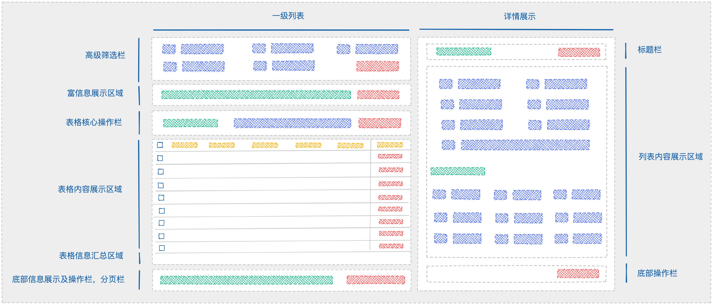
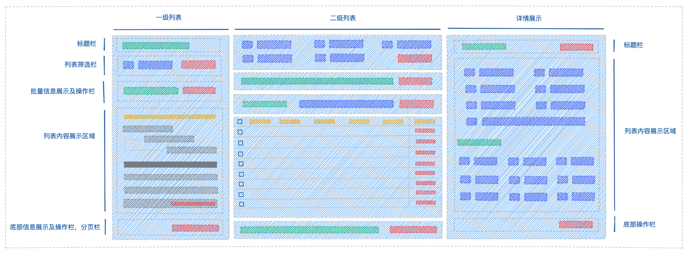

# 设计实践探索

## 全局样式

### 色彩

### 布局

### 字体

### 图标

### 阴影

### 动效

## 全局规则

### 数据录入

### 数据展示

### 数据格式

### 文案

### 按钮

### 导航

### 反馈

### 空状态

## 页面模板

### 表单页

### 工作台

### 列表页

#### 一般资源管理表格

#### 双栏资源管理表格

#### 三栏资源管理表格

### 结果页

### 异常页

### 数据可视化页

### 详情页
