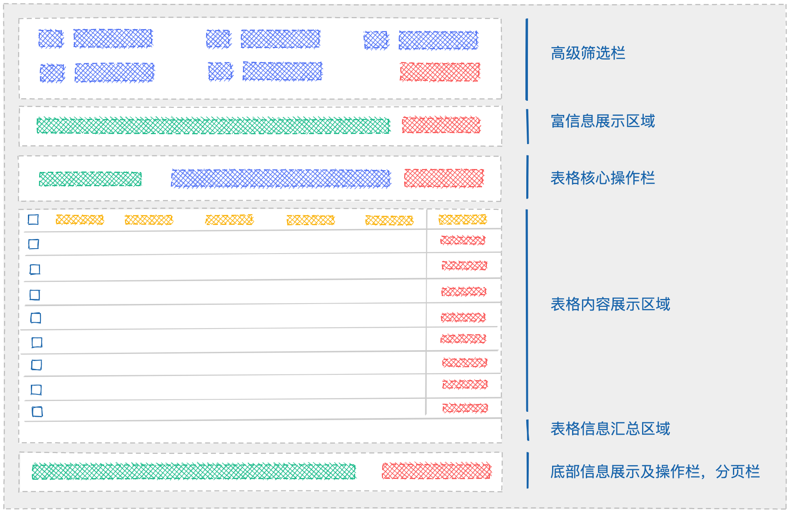
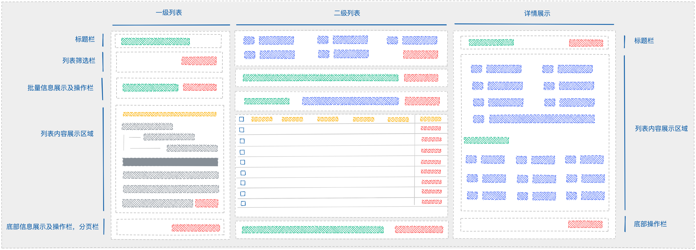

---
nav:
  order: 1
  title: design
group:
  title: 页面模板
  path: /design/page-templates
  order: 1
---

# 列表页

## 搜索表格

### 布局区域设计

### 示例 DEMO

<!--  -->

<code src="../../../../demos/general-search-table.tsx" />

### 业务页面对比效果

互换一般合约查询展示列表（左新右旧）：

  
  

互换一般合约创建（左新右旧）：

   
  

### 搜索表单布局方式

表格中搜索表单可以支持 2 种布局方式：`栅格`和`内联`，分别应用在当表格搜索字段数量`较多`和`较少`两种情况

搜索字段很多一旦出现换行，由于 label 长短不一，页面布局会显得混乱，对用户视觉上来说查询条件项不易定位，所以较多字段时候，默认使用栅格布局，对其进行整齐的排布；当搜索字段数量超过 2 行时，一下直接显示所有搜索条件会使首屏高度增大，为了页面更加美观，默认从第二行末尾开始隐藏后续字段，可以通过按钮展开和收起更多

> 建议高频使用的查询字段优先摆放在靠前位置

> 一行展示最大搜索字段数量可以人工定义，根据系统经验，默认值为 4

> 搜索表单收起样式  展开样式 

而当搜索字段很少，一行可以装下的时候，默认将搜索表单紧跟在搜索操作左侧，称作`内联`布局方式，一方面为了减少画面空白比，使得页面更加美观，另一方面因为就近原则，距离关联的搜索操作距离更近

> 内联展示样式 

<!-- > 设计待讨论，互换代码已经在原有功能上新增了展开收起功能，需要测试时间大概半人天 -->

### 核心操作区域设计

根据画面整体设计美观度和用户操作习惯，将表格核心操作区域设计在搜索表单和表格体之间的块状区域，由左右对称的两部分组成，由于表格行复选框常出现在最左侧，根据就近原则，左侧区域主要和批量操作内容相关，对应右侧位置，由于刚好符合一般用户关于主操作位置的习惯（左辅右主，上主下辅），所以默认放置了高频的搜索重置按钮，及表格其他核心功能触发器

> 未选中行时，批量操作按钮默认处于禁用状态，选中则重新激活 

> 批量和主操作区域 

当批量选择行后，需要额外展示更多丰富的信息时，可以通过气泡通知栏模式呈现

> 气泡通知栏批量信息展示 

左侧区除了包括批量信息外，根据实际需要也是表格标题（单容器中存在多表格时），表格内部 tabs 栏（相同搜索条件下的内容分类，展示列不一样时）出现的位置

> 表格标题展示 

> 表格内部 tabs 栏 

<!-- > 设计待讨论，互换代码需要支持表格内部 tabs 栏和批量信息通知栏形式展示，需要测试时间大概 2 人天，优先级极底 -->

### 视图管理交互展示设计

在复杂查询场景中，比如查询条件复杂，展现维度多样的情况下，用户常常需要固定一组表格对应的输入和输出信息，方便下次可以快速切换到该状态，我们将这样一组信息成为`视图`

通过点击 `创建视图` 主按钮，唤起创建表单对话框，填写相关信息后，点击 `确认` 按钮完成创建

> 真实情况下，用户在创建新的视图前，一定会先执行查询并关注表格展示的实际内容后才会决定是否创建视图，为了避免无效输入被保存，我们把这个行为合并到设计中：只当用户至少执行过一次搜索操作后，方才可以执行创建  或更新操作 ，将进入页面表格首次搜索包括在内

> 唤起创建视图表单 

之后按钮右上方会以飘带的形式显示当前所应用的 `视图` 名称

> 展示更新及另存新的视图 

鼠标 hover 时，将飘带显示层级降低至按钮层级之下

> hover 时展示效果 

为了用户方便理解和操作，我们将视图管理设计成一般的表格化资源管理方式，通过表格形式承载视图的增删查改操作

通过点击 `视图管理` 按钮，唤出视图资源查询列表对话框，表格支持多条件的分页查询，删除等资源管理操作，每条视图资源增加了对应的 `应用` 操作，点击 `应用` 后，首先将自动关闭列表弹窗，随后会自动填写视图资源中对应的搜索表单和列设置信息，紧接着马上执行一次外部表格的搜索行为

> 打开视图资源管理列表 

应用视图之后可以继续修改搜索表单或列设置，可以通过点击 `更新视图` 按钮实现视图信息更新，也可以点击 `另存视图为` 按钮复制，创建并应用新的视图资源

当用户需要删除当前所应用的视图，以执行后续操作，可以点击 `重置` 按钮清除当前视图，并恢复表格初始化状态后，默认进行一次搜索

初始化状态下，显示 `默认视图` 

2022 年 03 月 04 日 11:48:52 更新：

更新状态下，合并另存为和更新按钮 

### 列设置操作设计

当表格展示列很多时，用户常常需要根据自身情况配合搜索视图去对列进行检索后的过滤，排序，分组等操作，提升信息关注度

我们将列设置设计为中心化的管理方式在表格右侧以抽屉的形式展示，用户可以通过点击按钮唤出或关闭

检索输入框设计在抽屉头部，输入类型为文本，当用户停止持续的键入内容后超过指定的一段时间，自动执行一次列检索，此时仅展示文本匹配的列标题，清空输入恢复初始列表，重新打开抽屉保留输入及结果状态

用户可以通过勾选或取消列设置中的复选按钮实现列的显示及隐藏状态切换，或者可以直接在表格头部列上执行拖拽并在表格外部放下来可视化的实现这一行为；

> 勾选取消复选框 

> 表头部分可视化隐藏列 

排序及分组操作设计为拖拽形式更加符合用户直觉，使用体验上也更好，这里当用户通过拖拽列设置中的整行或行内的提示图标可以开始拖拽行为，在指定区域中的悬停过程将实时提示调整后的位置，松开放下则完成一次排序或者分组操作，如果在指定区域外放下，则默认不进行任何状态变化

> 拖拽状态 

### 底部区域设计

底部区域用户不会第一时间注意到，一般用来承载次要操作和辅助信息

表格底部区域呈块状，左右对称布局，区域内根据实际业务需求相应展示对应内容，右侧区域内当搜索功能开启时，默认显示分页器组件，左侧区域内当表格轮训功能开启时展示，默认会显示最近一次搜索时间戳，当表格需要对外展示轮播信息时也会出现在这里

> 功能组件出现的位置会根据实际情况作出相应的调整，以达到最佳的页面整体效果

> 最近搜索时间提示 

> 表格轮播提示信息 

## 资源表格

在搜索表格基础上，新增创建，编辑，查看，更新，删除操作场景

### 双栏布局

### 三栏布局

## 搜索列表

<!--  -->

## 卡片列表

<!--  -->
