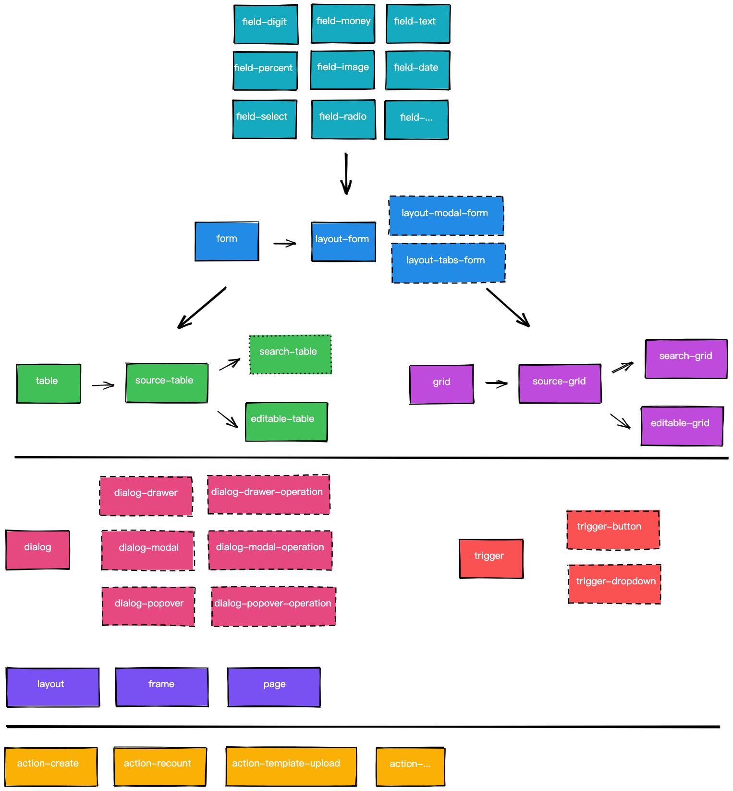

---
nav:
  title: one-start
  order: 1
  path: /one-start
title: one-start
group:
  order: -1
  title: general
  path: /one-start/general
---

# one-start

- 组件
- 功能
- 启用方式&使用场景

## 组件关系图



## 为什么要封装

因为不想花力气重新实现一模一样的功能，配置是封装 + 抽象的产物，可以极大提高开发效率，降低出错几率，统一设计交互样式

> 用机器码编写程序就如同用牙签吃东西

你可以这样做，但是请不要认为这么做是对的

组件状态和状态处理逻辑是密不可分的，状态的类型和处理方式组合形成了所谓组件功能的存在

经常变化的部分只是状态的输入源和处理逻辑内部的控制元，这部分其实可以通过静态配置 + 反转调用来暴露出去

## 如何设计接口

我们通过暴露 settings 和 requests 的方式：

settings 定义内部状态处理的方式

requets 定义状态的外部输入方式

settings 可以决定组件渲染方式，而不能决定组件渲染结果，因为 requests 的存在，整体组件是有副作用的存在，进而通过 refs + apis 暴露接口操作内部状态

### refs 收集器

方便注册 ref，可以使用 `OSReferencesCollectorProviderWrapper` 快速收集子节点的 ref

<code src="../demos/providers/references-collector.tsx" pure />

## 开发注意

1. 不要在根组件定义状态，避免大范围无效渲染
2. provider 是组件分类中的一项
3. hooks 中使用 actionsRef 等效于 ref
4. 内部操作封装在 actionsRef 中，useEffect 可以突出状态依赖
5. 启动类型接口封装成对象类型，一批关联聚合在一起

## 最佳实践

1. settings 相关接口优先合并定义
2. settings 开关类型接口提供 false 类型，默认关闭

## 实现细节注意

# 注意

- forms 的 validate 内部调用的是 getDataSource 获取 plain values
- forms 的 getDataSource 的返回所有非 hide 的字段的 plain values
- 自定义联动（非 field 注册的）同步类型在 fields 注册之后追加
- forms 类型组件提供了 value 和 onChange api，包括 table
- forms 的 requestDataSource 会触发 onChange
- forms 的 setFieldsValue 不会触发 onChange
- forms 的 requestDataSource 会触发 onChange
- forms 的 setDataSource 会触发 onChange
- table 的 requestDataSource 会触发 onChange
- table 的 setDataSource 会触发 onChange
- table 内部的 form values 和 dataSource 是绑定关系
- table 内部存在 vitrual dataSource 提供前端搜索功能的数据展示，和 dataSource 是绑定关系
- onChange 中不对数据进行 normalize，在定义 rule 和 linkage 等过程中，字段数据类型是高级对象，比如 Moment，BN
- [ ] forms 的 getFieldsValue 获取的是原始字段值
- [ ] 支持 digit BN 数据类型，onChange 也同时转换为 BN

- transform 返回的数据无法自动 normailized，比如日期要自行格式化

  ```ts
  search: {
      type: 'only',
      transform: (values) => ({
        reportStartDate: values?.[0]?.format('YYYY-MM-DD'),
        reportEndDate: values?.[1]?.format('YYYY-MM-DD'),
      }),
    },
  ```

  因为 form normalize 方法是根据 field item 的 type 进行处理
